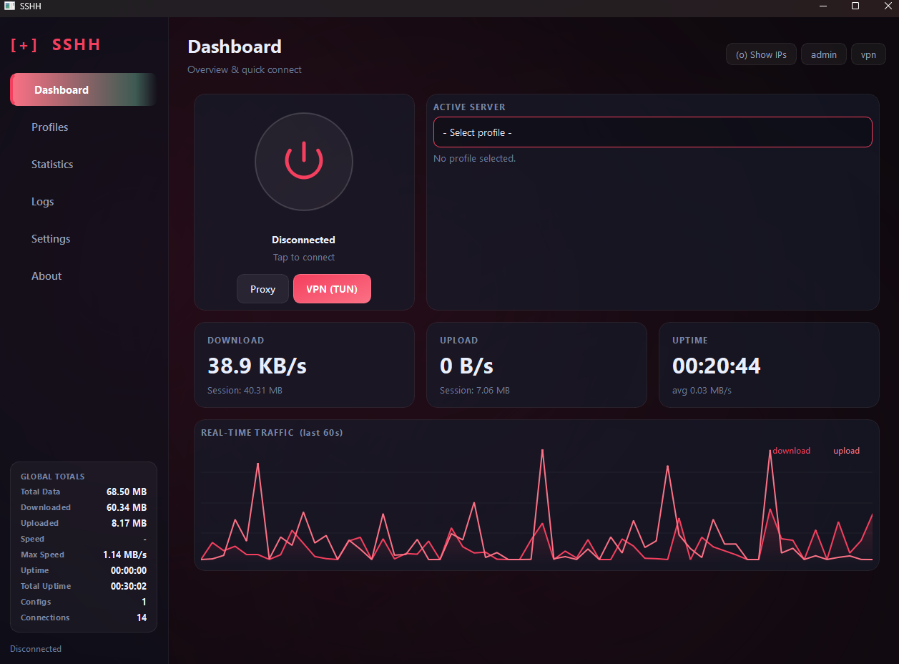
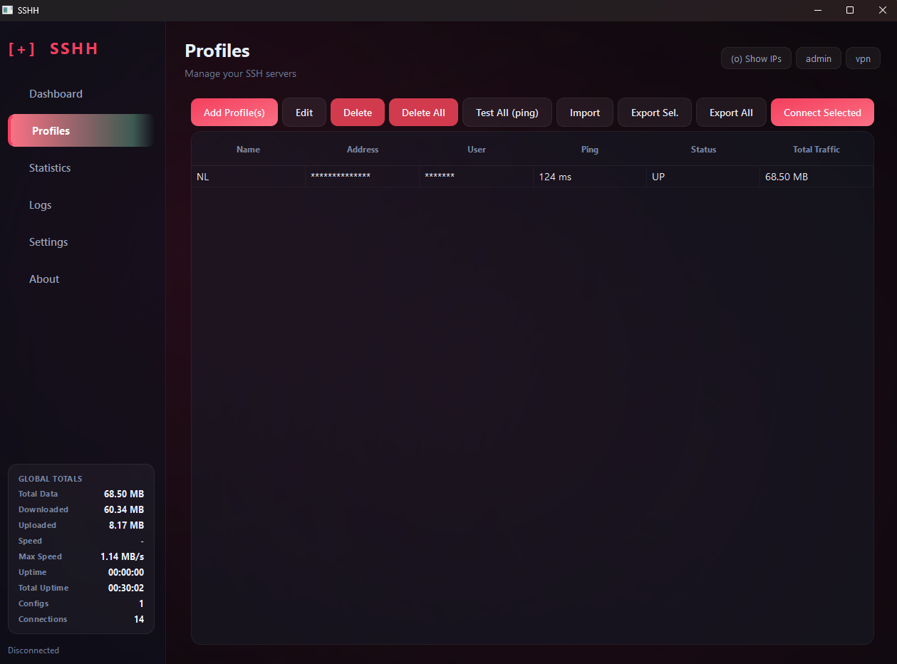
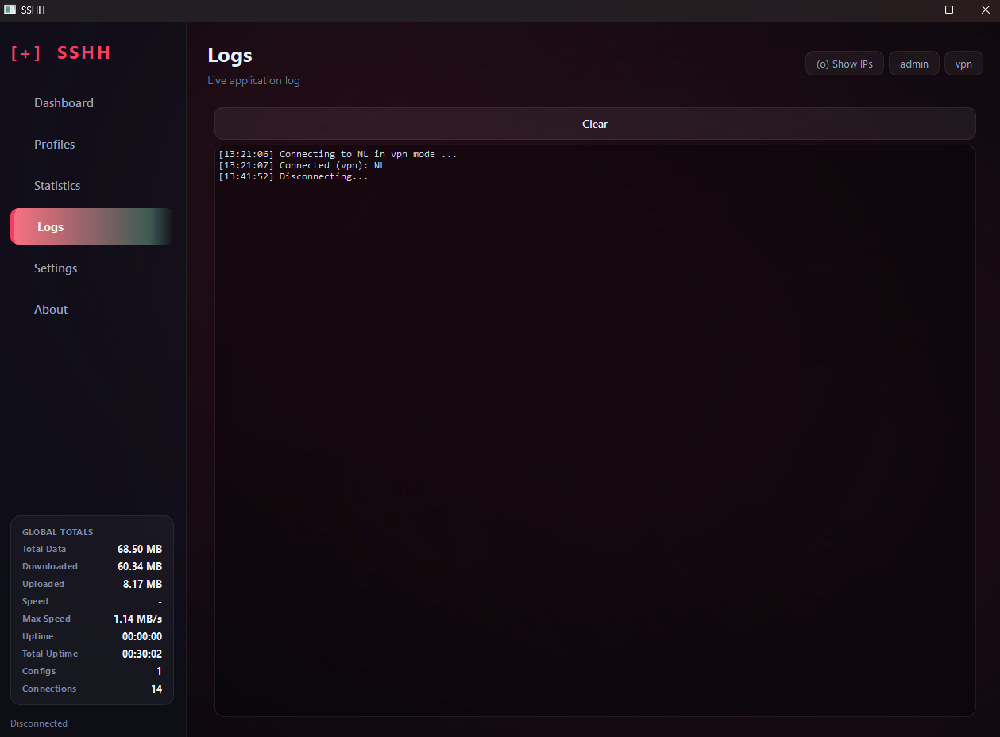
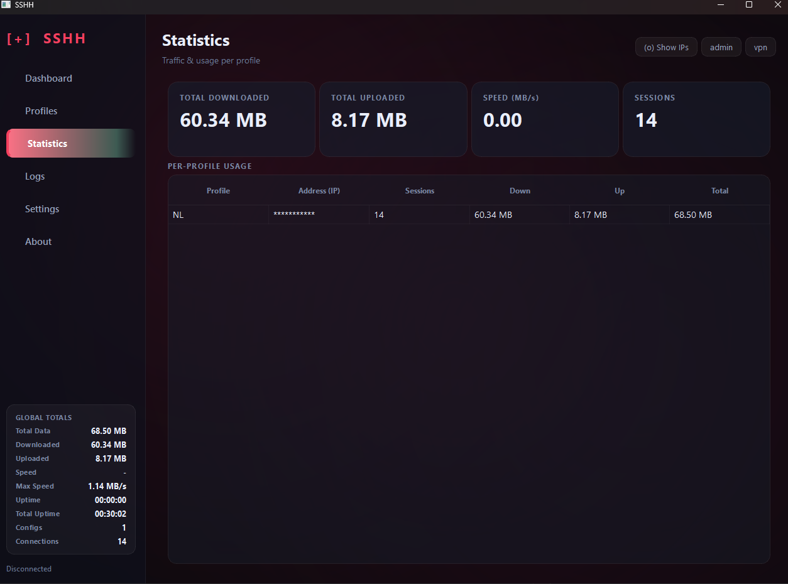
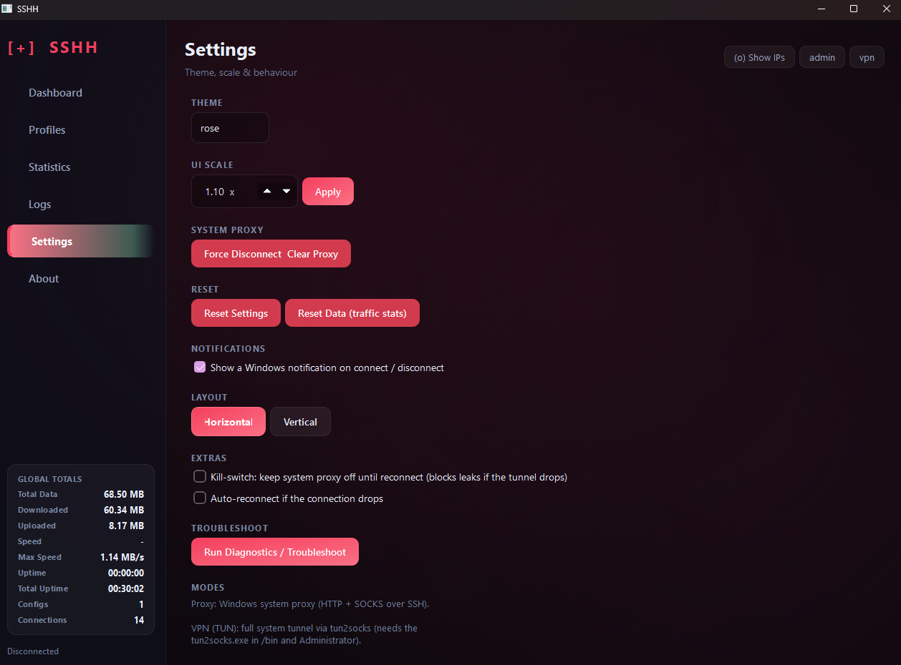
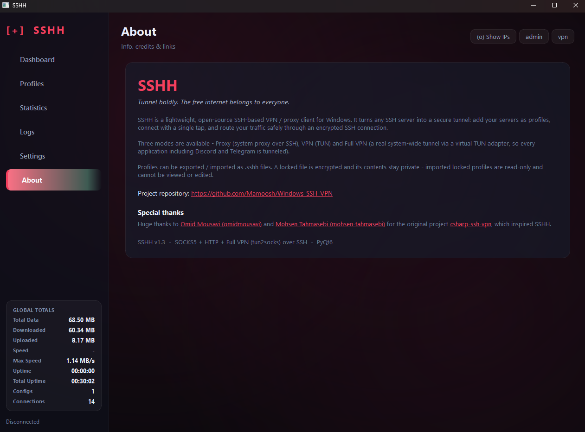

<div align="center">

 

# SSH VPN Client FOR WINDOWS
### Tunnel boldly. The free internet belongs to everyone.

A lightweight, beautiful, open-source **SSH-based VPN / proxy client for Windows**, built with Python & PyQt6.

[](LICENSE)


[English](#-english) · [فارسی](#-فارسی)

<!-- 👇 جای گیف/عکس اصلی -->


</div>

---

## 🌍 English

### What is SSHH?

**SSHH is *only a client*** — it does **not** provide servers or accounts.
Think of it like an SSH-tunnel manager: **you bring your own SSH server**, and SSHH turns it into a secure VPN/proxy on Windows with a single tap.

It is heavily inspired by projects like [csharp-ssh-vpn](https://github.com/omidmousavi/csharp-ssh-vpn) — but **prettier, written in Python**, with extra features such as **config locking/encryption**, profile import/export, live traffic stats, themes (dark *and* light), and Windows notifications.

> 💡 You need your own SSH server (a VPS, a seedbox, any Linux box with SSH). After you have the server credentials, just add them as a profile and connect.

### ✨ Features

- 🔌 **SSH-powered tunnel** — turns any SSH server into a secure SOCKS5 + HTTP proxy / VPN.
- 🎨 **20+ themes**, including **5 light themes** (light, snow, mint, sand, rosewater).
- 🔒 **Lockable configs** — export encrypted `.sshh` files; locked profiles are read-only and unviewable.
- 📦 **Import / export profiles** as portable `.sshh` files (with optional password).
- 📊 **Live stats** — real-time speed graph, per-profile traffic, uptime, sessions.
- 🔔 **Windows toast notifications** on connect / disconnect.
- 🧭 **Vertical / horizontal layout** modes.
- 🛟 **Kill-switch** & **auto-reconnect** options.
- 🩺 Built-in **diagnostics / troubleshoot** report.
- 🧪 **Demo mode** to hide your server IPs in screenshots.

### 🖼️ Screenshots

<div align="center">

<!-- جای عکس‌ها -->
 
 
 
</div>

### 🚀 Getting Started

#### Option A — Download the EXE (easiest)
Grab the latest `SSHH.exe` from the [**Releases**](../../releases) page and run it. (Admin is requested automatically for VPN mode.)

#### Option B — Run from source
```bash
git clone https://github.com/<your-username>/sshh-vpn.git
cd sshh-vpn
pip install -r requirements.txt
python main.py
```

### 🔧 How to connect

1. Get an **SSH server** (any VPS with SSH access).
2. Open SSHH → **Profiles** → **Add Profile(s)**.
3. Enter your server **host, port, username, and password** (or key file).
4. Pick a **mode** (Proxy or VPN) and hit the **power button**. ✅

### 📦 Build your own EXE

```bash
pip install pyinstaller
pyinstaller --onefile --noconsole --uac-admin --name SSHH --icon=icon.ico --add-data "bin;bin" main.py
```
The output lands in `dist/SSHH.exe`.

### 🧰 Tech Stack
Python · PyQt6 · paramiko · cryptography · tun2socks (for VPN mode)

### 📜 License
Released under the **PolyForm Noncommercial License 1.0.0**.
You may use, copy, modify, and **fork** this freely — but **you may not sell it**. SSHH is free for everyone. See [LICENSE](LICENSE).

### 🙏 Credits
Inspired by [csharp-ssh-vpn](https://github.com/omidmousavi/csharp-ssh-vpn) by [Omid Mousavi](https://github.com/omidmousavi) and [Mohsen Tahmasebi](https://github.com/mohsen-tahmasebi).

---

## 🇮🇷 فارسی

<div dir="rtl">

### اس اس اچ اچ (کلاینت اس اس اچ) چیست؟

**این برنامه فقط یک «کلاینت» است** — یعنی خودش **سرور یا اکانت نمی‌دهد**.
این برنامه مثل یک مدیریت‌کننده‌ی تونل اس اس اچ عمل می‌کند:
**شما سرور اس اس اچ خودتان را تهیه میکنید ** و اس اس اچ آن را با یک کلیک به یک VPN/پروکسی امن روی ویندوز تبدیل می‌کند.

این پروژه با الهام از پروژه‌هایی مانند [csharp-ssh-vpn](https://github.com/omidmousavi/csharp-ssh-vpn) ساخته شده — اما **زیباتر، با زبان پایتون**، و با قابلیت‌های بیشتری مثل **قفل/رمزنگاری کانفیگ**، ورود و خروج پروفایل‌ها، آمار زنده‌ی ترافیک، تم‌های متنوع (تیره **و** روشن) و نوتیفیکیشن ویندوز.

> 💡 شما به یک سرور SSH شخصی نیاز دارید (یک VPS، یا هر سرور لینوکسی که SSH داشته باشد). بعد از تهیه‌ی سرور و داشتن اطلاعات آن، کافیست آن را به‌عنوان یک پروفایل اضافه کرده و وصل شوید.

### ✨ امکانات

- 🔌 **تونل مبتنی بر SSH** — هر سرور SSH را به پروکسی امن SOCKS5 + HTTP یا VPN تبدیل می‌کند.
- 🎨 **بیش از ۲۰ تم**، شامل **۵ تم روشن** (light, snow, mint, sand, rosewater).
- 🔒 **کانفیگ قابل قفل** — خروجی رمزنگاری‌شده‌ی `.sshh`؛ پروفایل‌های قفل‌شده فقط‌خواندنی و غیرقابل‌مشاهده هستند.
- 📦 **ورود/خروج پروفایل‌ها** به‌صورت فایل‌های قابل‌حمل `.sshh` (با رمز اختیاری).
- 📊 **آمار زنده** — نمودار سرعت لحظه‌ای، ترافیک هر پروفایل، آپ‌تایم و تعداد اتصال‌ها.
- 🔔 **نوتیفیکیشن ویندوز** هنگام اتصال/قطع اتصال.
- 🧭 حالت چیدمان **عمودی / افقی**.
- 🛟 گزینه‌ی **Kill-switch** و **اتصال خودکار مجدد**.
- 🩺 گزارش **عیب‌یابی/Troubleshoot** داخلی.
- 🧪 **حالت دمو** برای پنهان کردن IP سرورها در اسکرین‌شات‌ها.

### 🚀 شروع به کار

#### روش الف — دانلود فایل EXE (ساده‌ترین)
آخرین نسخه‌ی `SSHH.exe` را از بخش [**Releases**](../../releases) دانلود و اجرا کنید. (برای حالت VPN، دسترسی ادمین به‌صورت خودکار درخواست می‌شود.)

#### روش ب — اجرا از سورس
```bash
git clone https://github.com/<your-username>/sshh-vpn.git
cd sshh-vpn
pip install -r requirements.txt
python main.py
```

### 🔧 نحوه‌ی اتصال

۱. یک **سرور SSH** تهیه کنید (هر VPS با دسترسی SSH).
۲. در SSHH به بخش **Profiles** → **Add Profile(s)** بروید.
۳. اطلاعات سرور یعنی **هاست، پورت، نام کاربری و رمز عبور** (یا فایل کلید) را وارد کنید.
۴. یک **مود** (Proxy یا VPN) انتخاب کرده و دکمه‌ی **پاور** را بزنید. ✅

### 📜 لایسنس

این پروژه تحت **PolyForm Noncommercial License 1.0.0** منتشر شده است.
شما آزادید آن را استفاده، کپی، تغییر و **فورک** کنید — اما **اجازه‌ی فروش آن را ندارید**. SSHH برای همه رایگان است. فایل [LICENSE](LICENSE) را ببینید.

### 🙏 تشکر

با الهام از پروژه‌ی [csharp-ssh-vpn](https://github.com/omidmousavi/csharp-ssh-vpn) ساخته‌ی [امید موسوی](https://github.com/omidmousavi) و [محسن طهماسبی](https://github.com/mohsen-tahmasebi).

</div>

---

<div align="center">
Made with ❤️ and Python · اگر این پروژه برایت مفید بود، یک ⭐ بده!
</div>
